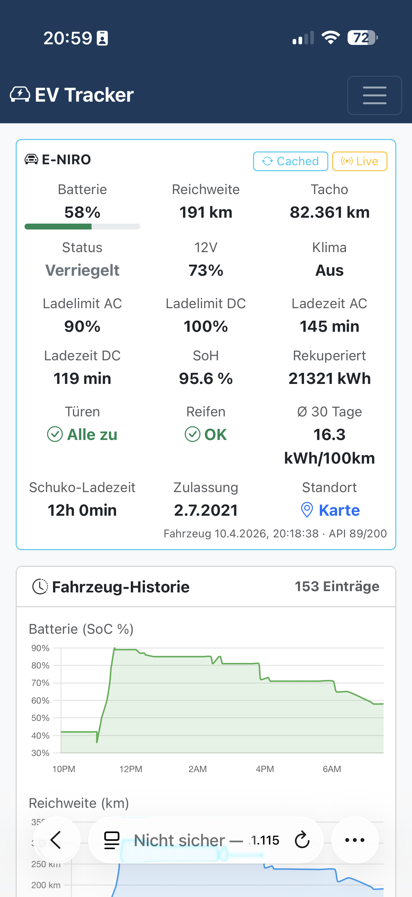
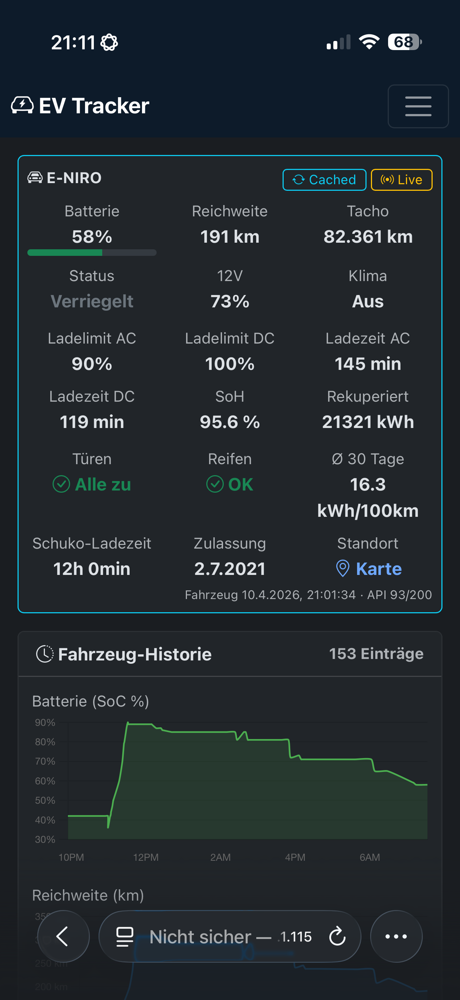
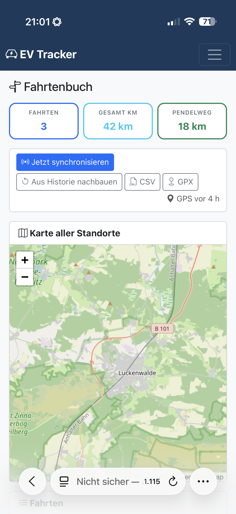
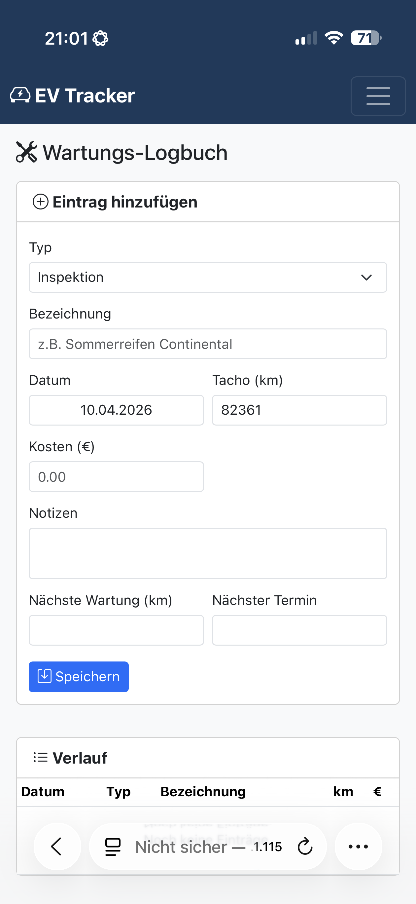
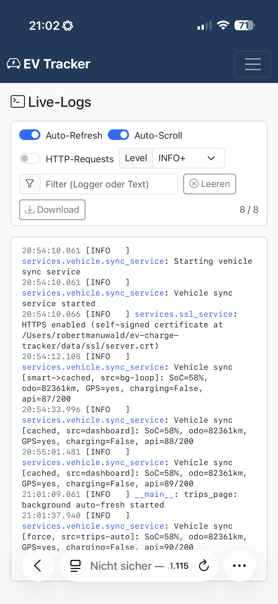

# EV Charge Tracker

> **Self-hosted dashboard for tracking your electric vehicle charges** — costs, kWh, CO2, recuperation, charging losses, and live vehicle status. Connects to 14 EV brands via API. Available in 6 languages.

[](https://github.com/robeertm/ev-charge-tracker/releases)
[](LICENSE)


Built for EV owners who want **full control over their charging data** — runs locally on your laptop, NAS, or Raspberry Pi. No cloud, no tracking, no subscription. Your data stays on your machine.

---

## Screenshots

### Dashboard

*Monthly cost chart, AC/DC/PV breakdown, yearly summary — everything on one page.*

### Dark Mode

*Day/night toggle synced across all tabs.*

### Live Vehicle Status
 
*Battery, range, odometer, 12V, SoH, tyre pressure, doors — pulled directly from the car via Vehicle API. Cached or live-refresh on demand.*

### Fahrtenbuch (Trip Log)

*Auto-built from GPS pings: trips, totals, commute distance, map of all stops, smart-sync every 10 min during waking hours.*

### New Charge — Start/Stop tracking

*AC / DC / **PV** button row, auto-fills SoC, odometer, and CO2 from the live grid. Start/Stop triggers a force-refresh from the car.*

### History

*Filter by year and charge type, inline edit km, CSV export.*

### Maintenance Log

*Inspections, tyres, parts — with cost tracking and next-service reminders by date or odometer.*

### Live Log Viewer

*In-app log window: auto-refresh, level filter, text search, optional HTTP access logging, CSV download.*

### Settings — Vehicle API

*Vehicle API auto-sync with configurable smart window (default 06:00 – 22:00, every 10 min). 14 supported brands, GHG quota, ENTSO-E, HTTPS, PV system — all configurable from the UI.*

---

## Why this app?

| Problem | Solution |
|---|---|
| Apps from your carmaker only show last 30-90 days | **Lifetime tracking** in your own database |
| No privacy / data sold to third parties | **100% local** — SQLite file on your machine |
| Cant compare AC vs DC vs PV cost & CO2 | Built-in **AC/DC/PV split** with separate tariffs |
| GHG quota payouts not tracked | **THG quota** card deducts payouts from total cost |
| Manual logging is tedious | **Vehicle API** auto-fills SoC, odometer, charging status |
| ENTSO-E grid CO2 not integrated | **Hourly CO2 intensity** auto-fetched, missing values backfilled |

---

## Features

### Tracking
- **Mobile-friendly input form** — quickly log charges from your phone, with Cancel button, native operator `<select>` (datalist-free so iOS Safari works), and optional GPS-captured station location
- **"My Location" uses the car's last GPS, not the phone** — pulls from the most recent `VehicleSync` row with coordinates so the station position reflects where the charge actually happened, even if you're back home when logging it. Phone GPS remains a secondary option
- **Operator price auto-fill** — configure per-operator `€/kWh` prices in Settings; picking an operator on the charge form auto-fills the price field (only while you haven't typed anything, so manual overrides are never lost)
- **Start/Stop charge tracking** — force-refresh from vehicle, auto-fill date/time/SoC/odometer, auto-stop when charge limit reached
- **Live vehicle status widget** on dashboard — SoC, range, odometer, doors, tires, climate, SoH, location
- **Vehicle history** — every sync persists SoC, range, odometer, 12V, SoH, recuperation, 30-day consumption, GPS. Stored only when a tracked value changes (compact, audit-friendly history)
- **Raw data viewer** (`/vehicle/raw`) — pretty-prints the full API dump for every sync, per brand, for debugging unusual SoH/range values
- **History** with filtering, inline km editing, CSV export
- **Full edit form** — every stored charge field (location, operator, coordinates, map picker) editable after the fact via `/edit/<id>`

### Driving log / Fahrtenbuch
- **Auto-detected parking events** — every vehicle sync hooks into a parking-event log; >100 m means "moved", new event opened, previous closed with arrival/departure odometer + SoC
- **Home / Work / Favorites** — pick locations on a Leaflet/OpenStreetMap card in Settings; events are auto-classified (home / work / favorite / other) within a 200 m radius. Favorites are inline-editable (rename, reposition via map, delete) with per-row action buttons
- **Trips page** at `/trips` — KPI cards (count, km, drive time, commute km), marker-cluster map, full table with from/to/km/duration/avg-speed/SoC
- **Full trip editor** — click the pencil on any trip row to open a two-column modal (Start / End) with every `ParkingEvent` field: label, favorite name, address, arrival/departure times, odometer and SoC at arrival/departure, coordinates. A shared Leaflet map below has draggable markers (blue = start, red = end) plus a "pick on map" button per side. Derived values (trip km, SoC used, recuperation) recompute automatically from the stored fields
- **7-day safety gate** on trip edits — entries older than 7 days require an explicit confirmation checkbox; server-enforced via 409 response, so hand-crafted requests can't bypass it
- **CSV + GPX export** — `/api/trips/export.csv` for the tax advisor, `/api/trips/export.gpx` for Google Earth / Komoot / OsmAnd
- **Smart sync mode** — runs cached by default but auto-upgrades to a force-refresh when GPS is older than 6 h and the car is not charging, so the Fahrtenbuch stays current without burning the daily API quota
- **Backfill** — replays existing vehicle syncs through the parking hook to retroactively rebuild the driving log

### Maintenance log / Wartungs-Logbuch
- **`/maintenance` page** — track inspections, tires, brakes, wipers, 12V battery, cabin filter, MOT/TUEV with date, odometer, cost and notes
- **Smart reminders** — entries can have a `next_due_km` and/or `next_due_date`; due-soon / overdue banner with sensible defaults per item type (e.g. inspection = 12 months / 30 000 km)

### Analytics
- **Dashboard** with KPI cards, Chart.js visualizations, and 7 vehicle-history mini time-series (SoC, range, odometer, 12V, SoH, recuperation, consumption)
- **Click-to-fullscreen on every plot** — each mini-chart is its own framed card with a fullscreen icon; click opens a Bootstrap `modal-fullscreen` with a larger version (thicker line, more axis ticks, grid, data-point circles). Time-range selector in the card header: 24h / 7d / 30d / 90d / 1y / all. Chosen range persists per-user in `AppConfig`
- **Last-known GPS** — the dashboard location card walks the vehicle-history series backwards to find the most recent GPS-bearing sync, so the map still renders under Kia/Hyundai cached mode where the latest sync typically has no coordinates
- **Range calculator** card — uses live SoC + battery capacity + 30-day consumption + outdoor temperature (Open-Meteo at home location), with a temperature penalty curve
- **Weather correlation** chart — bar (kWh/month) + line (avg outdoor degC) showing exactly why winter is more expensive
- **Highlights / fun facts** — cheapest/most expensive charge, biggest single charge, longest trip, fastest trip, longest park
- **PDF Report** — multi-page report with 10 charts, KPI overview, monthly/yearly/AC-DC-PV tables, vehicle-history time-series, Fahrtenbuch (last 80 trips with home<->work km for the German Pendlerpauschale), Wartungs-Logbuch, highlights page
- **CO2 break-even chart** — cumulative savings vs. battery production CO2 (well-to-wheel)
- **Recuperation stats** — total energy recovered, extra km, recuperation charge cycles
- **Cost & consumption per 100km** — net of GHG quota payouts
- **THG quota reminder** — banner Jan 1 - Mar 31 if no quota is logged for the previous year

### Integrations
- **14 vehicle brands** via API (see table below) — auto-fetch SoC, odometer, charging status
- **Brand feature matrix** in Settings — 10-item green/yellow/red grid per brand (SoC, GPS, 12V, SoH, recuperation, 30-day consumption, doors, climate, tires, live status). No more "wait, why isn't my car showing X" surprises.
- **ENTSO-E integration** — fetch hourly CO2 grid intensity for Germany, auto-backfill missing values
- **Open-Meteo** — daily mean temperatures for the range calculator and weather correlation, with DB cache (no key, no rate limits)
- **Nominatim reverse geocoding** — for street addresses on parking events and charge locations, with permanent DB cache and ToS-compliant rate limiter
- **CSV import with live preview** — upload your Google Sheet or exported CSV in Settings, get a dry-run preview showing detected delimiter, column mapping (per-column dropdown to correct misdetections), per-row action badges (`new` / `update` / `duplicate` / `empty` / `error`), and an error list with line numbers. Only when you hit "Import" does the data actually land in the DB. Automatic dedup by (date, hour, kWh) with 0.1 kWh tolerance
- **PV charging support** — third charge type with auto-calculated CO2 from PV system specs
- **Operator price directory** — Settings has an editable table of charging operators (19 built-ins + your customs) with per-operator `€/kWh`. Stored as JSON in `AppConfig` and consulted by the charge-entry form to auto-fill the price

### Security / HTTPS
- **Self-signed certificate** auto-generation via `cryptography` (or `openssl` CLI fallback). SAN entries cover `localhost`, `127.0.0.1`, and the LAN IP, so the same cert works on desktop AND smartphone
- **Three modes** in Settings: `off` (HTTP), `auto` (self-signed), `custom` (paths to your own Let's Encrypt cert)
- **Cert metadata viewer** + downloadable `.crt` to install on your phone via Profile (kills browser warnings permanently)
- HTTPS is required for the Geolocation API on smartphones — the auto mode gets you there in two clicks
- **Auto-hide** of the HTTPS card in Settings when the request comes from a Tailscale peer (100.64.0.0/10), since the VPN already provides transport encryption — less clutter for VM deployments

### Web-UI login (optional password gate)
- **Opt-in** front gate with username/password, shown before any route when enabled in Settings → Zugangsschutz
- **Werkzeug password hashing** (bcrypt-compatible), credentials in `AppConfig`
- **Flask signed session cookie** with a per-install random 32-byte secret that's generated on first boot and persisted — sessions survive restarts and updates
- **Use case**: when the Tailscale share link is known to other devices but you still want a password in front of your charge data

### First-run Setup Wizard (VM deployments)
- **Browser-based wizard** that appears on first access to a freshly provisioned VM (triggered by a `/srv/ev-data/.setup_pending` marker)
- **Two steps**: LUKS passphrase change (`sudo cryptsetup luksChangeKey` under the hood) and SSH login password change (`sudo chpasswd`)
- **Resume-safe**: progress is tracked in a state file so a mid-wizard reload doesn't reset the user
- **Result**: an end user can take ownership of a VM without touching a terminal — no SSH, no `cryptsetup`, no manpages

### Self-hosting / updates
- **In-app updater** — "Update available" button in Settings actually rolls out the new release on your machine (download zip, stage, detached helper swaps files, pip install, restart). No `git pull`, no terminal.
- **systemd-aware**: under systemd the file swap is done inline in the running process and the supervisor restarts the service; outside systemd the legacy detached-helper flow is used
- **Automatic rollback on a broken update** — before every swap, a backup of the files that would be overwritten is written to `updates/backup_pre_v<OLD>/` along with a `UPDATE_PENDING.json` marker. On each boot, a pre-flight state machine checks the marker: three failed boots in a row (or a port-7654 bind timeout within 60 seconds of launch) trigger an automatic restore of the previous version plus a `LAST_ROLLBACK.json` note for the UI. Works under any supervisor that restarts on crash. `data/`, `venv/`, `.git/`, `logs/`, `updates/` are never touched by the backup/restore.
- **Dashboard update banner** — a visible banner appears on the dashboard when a newer release is available; clicking jumps directly to `Settings → #updaterCard`. If the last update auto-rolled back, a second banner explains which versions were involved and offers a one-click dismiss (`DELETE /api/update/last-rollback`). Update-check response is cached in `sessionStorage` for 30 minutes so page-hopping doesn't hit the GitHub API on every view.
- **Restart button** in Settings for applying HTTPS changes or new certs
- **API rate limiter** — tracks daily API calls (Kia EU: 190/200 limit), counter on dashboard

### VM deployment (multi-user rollout)
- **Templated VM image** for DS1621+ / Synology VMM and other hypervisors: Debian base with Xvfb + x11vnc + noVNC for the Kia token capture flow, XRDP for occasional maintenance, UFW restricted to the `tailscale0` interface, systemd unit with `Restart=always` and `ConditionPathExists=/srv/ev-data/app/venv/bin/python` so it skips cleanly while the LUKS volume is locked
- **`ev-provision` script** on each clone — auto-detects the data disk, formats LUKS with a temporary passphrase, registers with Tailscale via a pre-auth key, sets up sudoers entries for the wizard, enables UFW, prints handover info
- **`ev-unlock` helper** — one command after VM boot, opens the LUKS volume, mounts it, starts the app
- **End-to-end flow**: admin clones the template → runs `ev-provision` once → shares the VM via Tailscale device sharing → user runs through the browser wizard → done

### UX
- **Dark/Light mode** — toggle in navbar, synced across all tabs via localStorage
- **6 languages** — German, English, French, Spanish, Italian, Dutch (~800 translated strings per locale)

---

## Quick Start

```bash
# Clone
git clone https://github.com/robeertm/ev-charge-tracker.git
cd ev-charge-tracker

# Quick start (recommended)
# macOS:   double-click start.command
# Linux:   ./start.sh
# Windows: double-click start.bat

# Or manually:
pip install -r requirements.txt
python app.py
```

Open `http://localhost:7654` in your browser.
From your phone (same network): `http://<your-pc-ip>:7654`

---

## Vehicle API — Supported Brands

Connect your car to automatically fetch SoC, odometer, and charging status. All packages installable directly from Settings UI (no terminal needed).

| Brand | Package | Auth |
|-------|---------|------|
| **Kia** | `hyundai-kia-connect-api` | Refresh-Token (OAuth via Selenium) |
| **Hyundai** | `hyundai-kia-connect-api` | Refresh-Token (OAuth via Selenium) |
| **Volkswagen** | `carconnectivity` + connector | Username / Password |
| **Skoda** | `carconnectivity` + connector | Username / Password |
| **Seat** | `carconnectivity` + connector | Username / Password |
| **Cupra** | `carconnectivity` + connector | Username / Password |
| **Audi** | `carconnectivity` + connector | Username / Password |
| **Tesla** | `teslapy` | OAuth Refresh-Token |
| **Renault** | `renault-api` | Username / Password |
| **Dacia** | `renault-api` | Username / Password |
| **Polestar** | `pypolestar` | Username / Password |
| **MG (SAIC)** | `saic-ismart-client-ng` | Username / Password |
| **Smart #1/#3** | `pySmartHashtag` | Username / Password |
| **Porsche** | `pyporscheconnectapi` | Username / Password |

After installing, configure credentials in Settings > Vehicle API. Optional background sync polls your vehicle at a configurable interval (1-12h).

**Kia/Hyundai note:** Password login is blocked by reCAPTCHA. Use the "Fetch Token" button in settings — opens Chrome with mobile user-agent for the OAuth flow. Token is valid for ~1 year.

---

## Import from Google Sheet

**Via Web UI (recommended):**
1. Open your Google Sheet > File > Download > CSV
2. In the app: Settings > Database > CSV Import > Upload

**Via CLI:**
```bash
python import_gsheet.py downloaded_file.csv
```

The importer handles German number format (comma as decimal separator) and various date formats. Missing CO2 values are automatically fetched from ENTSO-E in the background after import.

---

## ENTSO-E Setup

1. Register at [transparency.entsoe.eu](https://transparency.entsoe.eu/)
2. Request an API token via email
3. Enter the token in Settings within the app
4. Optionally select the charging hour for hour-specific CO2 data

---

## Vehicle Settings

Configure in Settings > Vehicle:

| Setting | Default | Description |
|---------|---------|-------------|
| Battery capacity | 64 kWh | Battery size for cycle & loss calculation |
| Max AC power | -- | Max AC charging power |
| Battery production CO2 | 100 kg/kWh | For break-even calculation (MY2021) |
| ICE CO2 WTW | 164 g/km | Well-to-wheel comparison (DE average) |
| Recuperation | 0.086 kWh/km | Energy recovered per km |

### PV System (Settings > PV)

| Setting | Default | Description |
|---------|---------|-------------|
| System size | -- | kWp of your PV system |
| Annual yield | 950 kWh/kWp | Annual yield per kWp (DE average) |
| Lifetime | 25 years | Expected system lifetime |
| Manufacturing CO2 | 1000 kg/kWp | Production CO2 incl. transport & installation |
| PV electricity price | 0.00 EUR/kWh | Self-consumption cost |

---

## Languages

Switchable from Settings > Language:

- Deutsch
- English
- Francais
- Espanol
- Italiano
- Nederlands

~800 translated strings per language. Falls back to German if a key is missing. New languages can be added by dropping a `<lang>.json` file into `translations/`.

---

## Tech Stack

- **Backend:** Python 3.10+, Flask, SQLAlchemy, SQLite
- **Frontend:** Bootstrap 5.3 (with dark mode), Chart.js
- **PDF:** matplotlib + fpdf2
- **Data:** ENTSO-E Transparency Platform API
- **Vehicle APIs:** hyundai-kia-connect-api, teslapy, renault-api, pypolestar, saic-ismart-client-ng, pySmartHashtag, pyporscheconnectapi, carconnectivity

---

## Contributing

Pull requests welcome! Areas where help is appreciated:
- More vehicle API connectors
- Additional language translations (just add `translations/<lang>.json`)
- Charts and analytics ideas
- Mobile UX improvements

---

## License

Robert Manuwald 2021-2026
