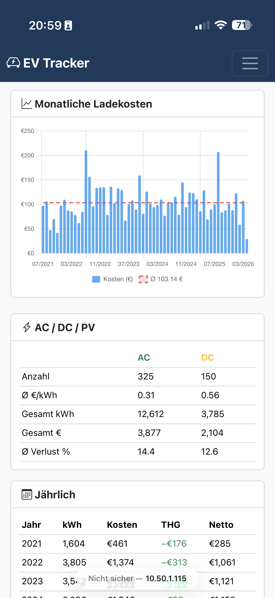
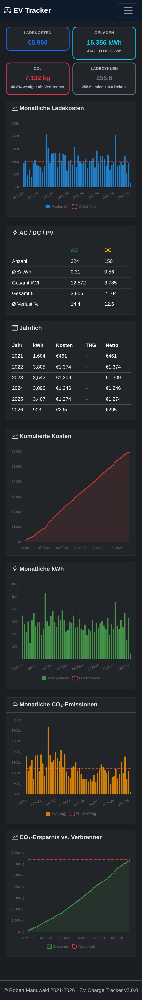
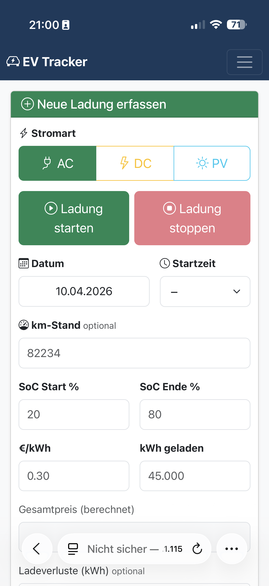
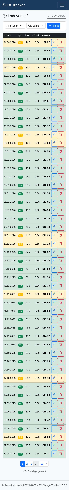
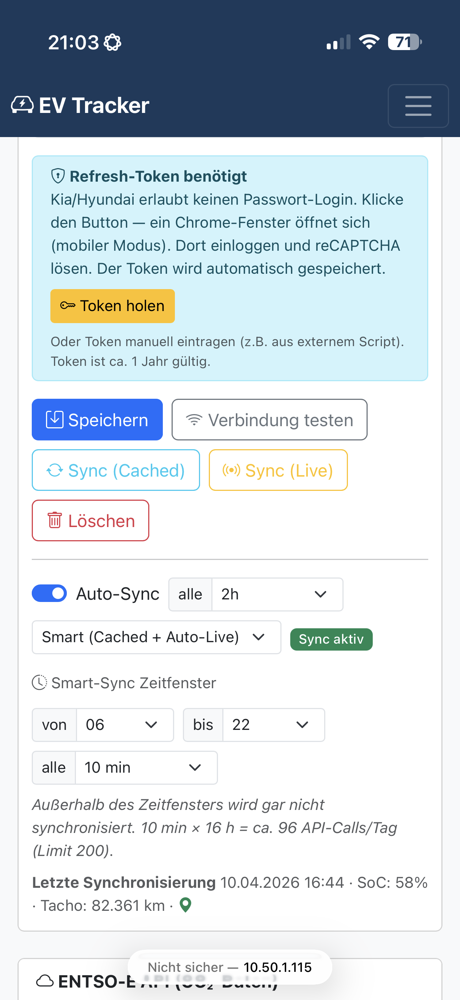
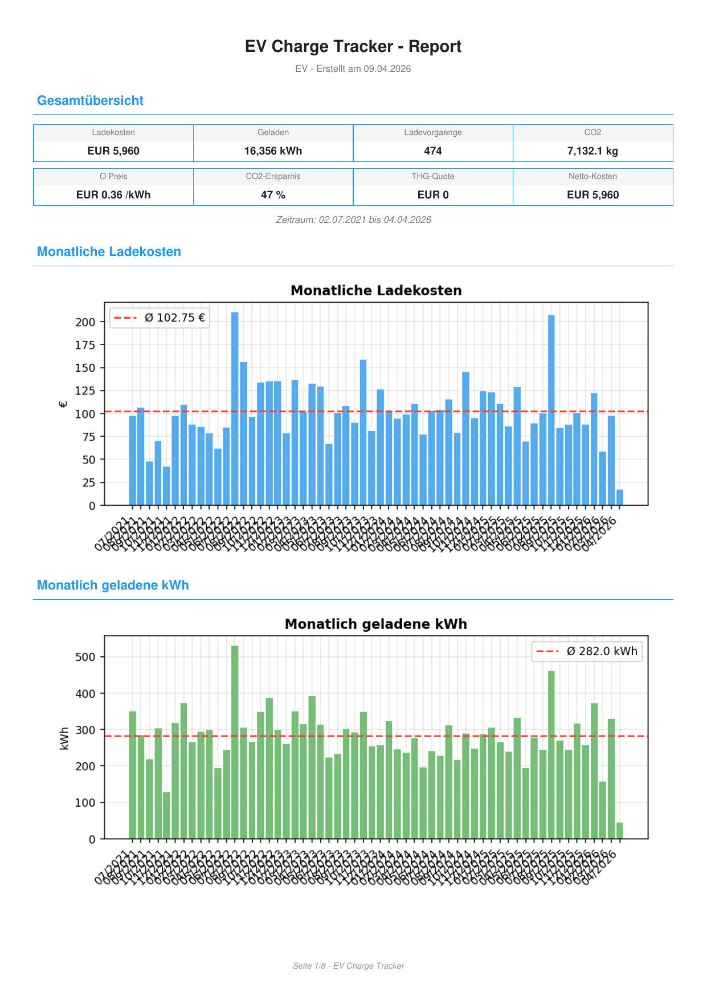

# EV Charge Tracker

> **Self-hosted dashboard for tracking your electric vehicle charges** — costs, kWh, CO2, recuperation, charging losses, and live vehicle status. Connects to 14 EV brands via API. Available in 6 languages.

[](https://github.com/robeertm/ev-charge-tracker/releases)
[](LICENSE)


Built for EV owners who want **full control over their charging data** — runs locally on your laptop, NAS, or Raspberry Pi. No cloud, no tracking, no subscription. Your data stays on your machine.

---

## Screenshots

> Drop your screenshots into `docs/screenshots/` with the filenames below and they will appear here automatically.

### Dashboard

*Live vehicle status, KPI cards, and charts at a glance.*

### Dark Mode

*Day/night toggle synced across all tabs.*

### New Charge — Start/Stop tracking

*Start/Stop buttons trigger force-refresh from your car. Auto-fills SoC, odometer, and CO2 from the live grid.*

### History

*Filter by year and charge type, inline edit km, CSV export.*

### Settings

*Vehicle, PV system, GHG quota, ENTSO-E, language, and Vehicle API — all configurable from the UI.*

### PDF Report

*Multi-page PDF with 10 charts and detailed monthly/yearly breakdowns.*

---

## Why this app?

| Problem | Solution |
|---|---|
| Apps from your carmaker only show last 30-90 days | **Lifetime tracking** in your own database |
| No privacy / data sold to third parties | **100% local** — SQLite file on your machine |
| Cant compare AC vs DC vs PV cost & CO2 | Built-in **AC/DC/PV split** with separate tariffs |
| GHG quota payouts not tracked | **THG quota** card deducts payouts from total cost |
| Manual logging is tedious | **Vehicle API** auto-fills SoC, odometer, charging status |
| ENTSO-E grid CO2 not integrated | **Hourly CO2 intensity** auto-fetched, missing values backfilled |

---

## Features

### Tracking
- **Mobile-friendly input form** — quickly log charges from your phone
- **Start/Stop charge tracking** — force-refresh from vehicle, auto-fill date/time/SoC/odometer, auto-stop when charge limit reached
- **Live vehicle status widget** on dashboard — SoC, range, odometer, doors, tires, climate, SoH, location
- **History** with filtering, inline km editing, CSV export

### Analytics
- **Dashboard** with KPI cards and Chart.js visualizations
- **PDF Report** — multi-page report with 10 charts, KPI overview, monthly/yearly/AC-DC-PV tables
- **CO2 break-even chart** — cumulative savings vs. battery production CO2 (well-to-wheel)
- **Recuperation stats** — total energy recovered, extra km, recuperation charge cycles
- **Cost & consumption per 100km** — net of GHG quota payouts

### Integrations
- **14 vehicle brands** via API (see table below) — auto-fetch SoC, odometer, charging status
- **ENTSO-E integration** — fetch hourly CO2 grid intensity for Germany, auto-backfill missing values
- **CSV import** — upload Google Sheet CSV directly in settings UI
- **PV charging support** — third charge type with auto-calculated CO2 from PV system specs

### UX
- **Dark/Light mode** — toggle in navbar, synced across all tabs via localStorage
- **6 languages** — German, English, French, Spanish, Italian, Dutch
- **Auto-updater** via GitHub releases
- **API rate limiter** — tracks daily API calls (Kia EU: 190/200 limit)

---

## Quick Start

```bash
# Clone
git clone https://github.com/robeertm/ev-charge-tracker.git
cd ev-charge-tracker

# Quick start (recommended)
# macOS:   double-click start.command
# Linux:   ./start.sh
# Windows: double-click start.bat

# Or manually:
pip install -r requirements.txt
python app.py
```

Open `http://localhost:7654` in your browser.
From your phone (same network): `http://<your-pc-ip>:7654`

---

## Vehicle API — Supported Brands

Connect your car to automatically fetch SoC, odometer, and charging status. All packages installable directly from Settings UI (no terminal needed).

| Brand | Package | Auth |
|-------|---------|------|
| **Kia** | `hyundai-kia-connect-api` | Refresh-Token (OAuth via Selenium) |
| **Hyundai** | `hyundai-kia-connect-api` | Refresh-Token (OAuth via Selenium) |
| **Volkswagen** | `carconnectivity` + connector | Username / Password |
| **Skoda** | `carconnectivity` + connector | Username / Password |
| **Seat** | `carconnectivity` + connector | Username / Password |
| **Cupra** | `carconnectivity` + connector | Username / Password |
| **Audi** | `carconnectivity` + connector | Username / Password |
| **Tesla** | `teslapy` | OAuth Refresh-Token |
| **Renault** | `renault-api` | Username / Password |
| **Dacia** | `renault-api` | Username / Password |
| **Polestar** | `pypolestar` | Username / Password |
| **MG (SAIC)** | `saic-ismart-client-ng` | Username / Password |
| **Smart #1/#3** | `pySmartHashtag` | Username / Password |
| **Porsche** | `pyporscheconnectapi` | Username / Password |

After installing, configure credentials in Settings > Vehicle API. Optional background sync polls your vehicle at a configurable interval (1-12h).

**Kia/Hyundai note:** Password login is blocked by reCAPTCHA. Use the "Fetch Token" button in settings — opens Chrome with mobile user-agent for the OAuth flow. Token is valid for ~1 year.

---

## Import from Google Sheet

**Via Web UI (recommended):**
1. Open your Google Sheet > File > Download > CSV
2. In the app: Settings > Database > CSV Import > Upload

**Via CLI:**
```bash
python import_gsheet.py downloaded_file.csv
```

The importer handles German number format (comma as decimal separator) and various date formats. Missing CO2 values are automatically fetched from ENTSO-E in the background after import.

---

## ENTSO-E Setup

1. Register at [transparency.entsoe.eu](https://transparency.entsoe.eu/)
2. Request an API token via email
3. Enter the token in Settings within the app
4. Optionally select the charging hour for hour-specific CO2 data

---

## Vehicle Settings

Configure in Settings > Vehicle:

| Setting | Default | Description |
|---------|---------|-------------|
| Battery capacity | 64 kWh | Battery size for cycle & loss calculation |
| Max AC power | -- | Max AC charging power |
| Battery production CO2 | 100 kg/kWh | For break-even calculation (MY2021) |
| ICE CO2 WTW | 164 g/km | Well-to-wheel comparison (DE average) |
| Recuperation | 0.086 kWh/km | Energy recovered per km |

### PV System (Settings > PV)

| Setting | Default | Description |
|---------|---------|-------------|
| System size | -- | kWp of your PV system |
| Annual yield | 950 kWh/kWp | Annual yield per kWp (DE average) |
| Lifetime | 25 years | Expected system lifetime |
| Manufacturing CO2 | 1000 kg/kWp | Production CO2 incl. transport & installation |
| PV electricity price | 0.00 EUR/kWh | Self-consumption cost |

---

## Languages

Switchable from Settings > Language:

- Deutsch
- English
- Francais
- Espanol
- Italiano
- Nederlands

286 translated strings per language. Falls back to German if a key is missing. New languages can be added by dropping a `<lang>.json` file into `translations/`.

---

## Tech Stack

- **Backend:** Python 3.10+, Flask, SQLAlchemy, SQLite
- **Frontend:** Bootstrap 5.3 (with dark mode), Chart.js
- **PDF:** matplotlib + fpdf2
- **Data:** ENTSO-E Transparency Platform API
- **Vehicle APIs:** hyundai-kia-connect-api, teslapy, renault-api, pypolestar, saic-ismart-client-ng, pySmartHashtag, pyporscheconnectapi, carconnectivity

---

## Contributing

Pull requests welcome! Areas where help is appreciated:
- More vehicle API connectors
- Additional language translations (just add `translations/<lang>.json`)
- Charts and analytics ideas
- Mobile UX improvements

---

## License

Robert Manuwald 2021-2026
